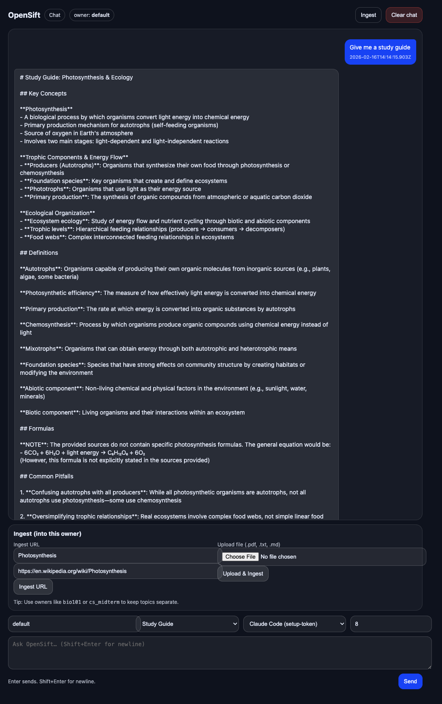
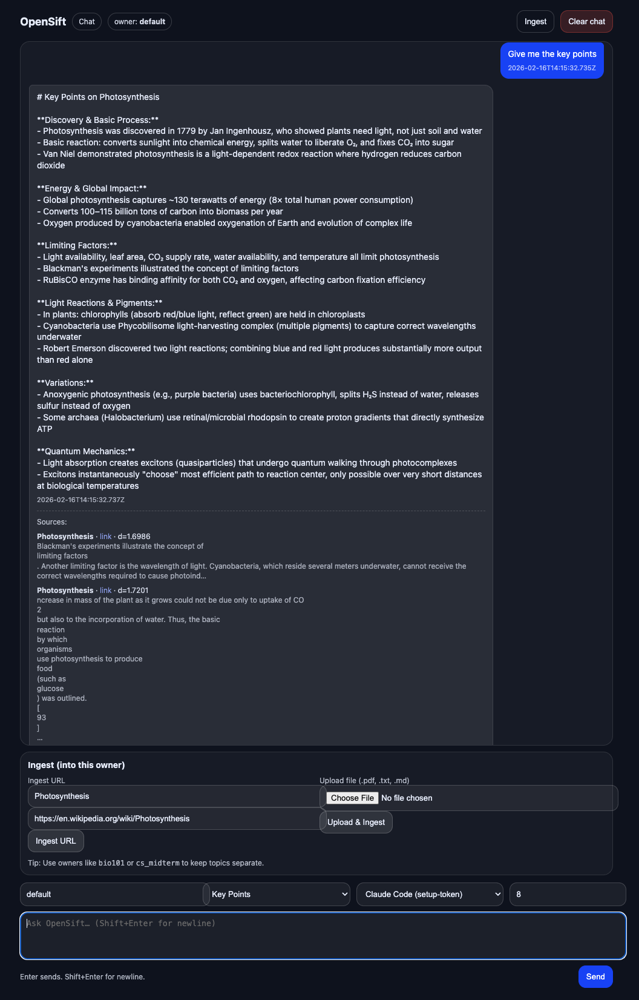
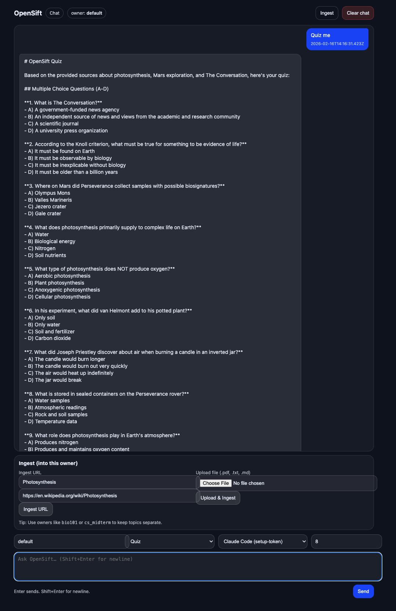

# OpenSift

**Sift faster. Study smarter.**

OpenSift is an AI-powered, local-first study assistant for working through large source sets (PDFs, URLs, notes) with grounded retrieval and generation.

Core workflow:
1. Ingest content (URL, PDF, TXT, MD)
2. Retrieve relevant chunks from local vector search
3. Generate study output with your selected provider

Outputs include:
- Study guides
- Key points and summaries
- Quizzes
- Flashcards

## Quick links
- [Documentation](docs/index.md)
- [Quick Start](docs/quickstart.md)
- [Chat UI](docs/ui.md)
- [Ingestion](docs/ingestion.md)
- [Providers](docs/providers.md)
- [Troubleshooting](docs/troubleshooting.md)
- [Security](docs/security.md)

## Notes
- OpenSift is currently a hobby proof-of-concept project.
- The UI is designed for localhost usage.
- Recommended runtime is the gateway runner: `python opensift.py gateway --with-mcp`.

## Screenshots

